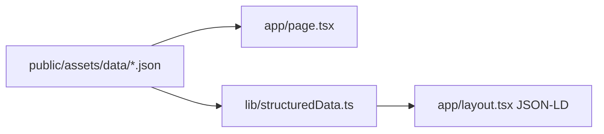

# Write a PR title and description

Use this template for writing the PR body:

```markdown
## Summary

<diagram, diff-sketch, or tree>

## Evidence

- **Before:** <screenshot/output>
  **After:** <screenshot/output>

## Content

- <entries added / updated / removed in public/assets/data/*.json>
- llms.txt and layout.tsx metadata: <synced | not affected>

## Merge Danger

**Door:** one-way or two-way
**Blast Radius:** <potential ramifications of merge>

Closes #NN.
```

> This repo tracks work in GitHub issues on `AlexisBalayre/portfolio-v2`; there is no external
> tracker. Reference an issue as `#NN`. No issue? Drop the id and the closing line everywhere.

## Sections

Skip all preambles and keep prose brief. Use the domain language from `docs/glossary.md` (Section, Content JSON, Timeline item, Tier, ...).

### Summary

Pick the smallest view that makes the key point clear.

- Show logic as pseudocode:

```text
on(section link click)
  close the mobile menu
  scroll the section into view
```

- Show UI structure as a component tree, including state and module boundaries that matter:

```tsx
<RootLayout> (app/layout.tsx)
  <Header> (components/Header.tsx)
    useOutsideClick()
  <Home> (app/page.tsx)
    <Timeline items={experiences} />
    <Projects />
```

- Show file responsibility or a broad refactor as a shallow file tree:

```text
app/                 # layout (SEO) + the one page
components/          # Header, Footer, generic renderers
lib/                 # structured-data builder
public/assets/data/  # all content
```

- Show data flow with Mermaid when several pieces interact (content JSON → renderers, JSON-LD, llms.txt, sitemap):



- Use `diff` when the point is what changes and the surrounding shape already exists. Match the diff shape to the topic.

For a component change:

```diff
 <Home>
   <Timeline items={experiences} />
+  <Timeline items={hackathons} />
   <Projects />
```

For a file-layout change:

```diff
 app/
 ├── layout.tsx
+├── opengraph-image.tsx   # build-time social card
 └── page.tsx
+lib/
+└── structuredData.ts     # schema.org @graph
```

- Show the whole block when most of it is new, when omitted context would hide ownership or order, or when the reviewer needs a copyable target shape.

#### Guidance

Place each visual next to the short text it supports. Keep only the components, files, props, states, and boundaries needed to understand the change. Use one view, sometimes several, rarely all; don't overwhelm the reviewer. A content-only or config-only PR can skip the visual and use two or three concrete bullets instead.

### Evidence

Concrete evidence that the change works. Show a before and after.

Screenshots are S-tier for anything visual (desktop and mobile width when layout is involved; `yarn dev` or the Vercel preview).

Execution-based evidence is A-tier: `yarn build` output, the rendered JSON-LD or `robots.txt`, a Rich Results / validator result for SEO changes. The site has no test suite; don't claim tests. Lint and typecheck run on every agent turn, so mention them only when they were the point.

### Content

Include only when `public/assets/data/*.json`, `public/llms.txt`, or `public/assets/img/` changed. List the entries added, updated, or removed and confirm `llms.txt` and the `layout.tsx` / `lib/structuredData.ts` metadata were kept in sync (`docs/conventions/content.md` §Keep in sync).

### Merge Danger

Describe whether it's a one-way or two-way door. You can walk back through two-way doors, but not one-way doors. A PR that is cheap to roll back is lower risk; on this site almost everything is a two-way door (a Vercel redeploy), except what leaves the site: URLs search engines have indexed, structured data they cache, and published social cards.

The blast radius is the potential impact of the change: layout shift, mobile responsiveness, dark/light theme, broken section anchors, search and social previews (metadata, JSON-LD, OG image, sitemap), and AI-crawler access (`robots.txt`, `llms.txt`).

## Workflow

1. **Gather context** (run together):

   The trunk is `GIT_TRUNK` from `.claude/project.env` (`main`).

   ```sh
   git branch --show-current                              # MUST NOT be "main"; abort if it is
   git log main..HEAD --pretty=format:'%h %s%n%b'         # commits on this branch
   git diff main...HEAD --stat                            # changed files + churn
   gh pr view --json number,url,state,title,body 2>/dev/null   # non-zero exit = no PR yet
   ```

   Read the diff for the key files (`git diff main...HEAD -- <path>`); on large diffs lean on `--stat` plus the important files.

2. **Ground in the issue (read-only).** Grep branch name + commit subjects for `#\d+` or `issue-\d+`. If found, `gh issue view <n>` for the problem, the intent, and the canonical link. No id: derive from diff + commits.

3. **Draft title + body together.** Title per [Title format](#title-format); body to a temp file (`mktemp`) per the template and [Sections](#sections), obeying [Body rules](#body-rules). Include only the sections that apply. For an existing PR, treat the current title and body as a draft, not a constraint.

4. **Create or update the PR.** Show the drafted **title** and **body** + the exact `gh` command; quick confirm before running unless told to just do it.

   ```sh
   git rev-parse --abbrev-ref --symbolic-full-name @{u} 2>/dev/null || git push -u origin "$(git branch --show-current)"
   # update existing; pass --title only if it changes:
   gh pr edit <number> --body-file <tmp> [--title "<drafted title>"]
   # or create new:
   gh pr create --base main --title "<drafted title>" --body-file <tmp>
   ```

   Report the PR URL.

## Title format

Communicate *what changed and why* at a glance, specific enough that a reviewer can predict the diff. GitHub auto-appends ` (#NNNN)` on merge; do not write it yourself.

```
<type>(<scope>): <summary> (#NN)
```

- **`<type>`**: dominant intent of the diff.

  | Type       | Use for                                     |
  | :--------- | :------------------------------------------ |
  | `feat`     | New section, component, or capability       |
  | `fix`      | Bug fix (layout, links, metadata, build)    |
  | `content`  | Portfolio content only (`public/assets/data/*.json`, `llms.txt`, images) |
  | `refactor` | Code restructuring with no behaviour change |
  | `docs`     | Documentation only (`docs/`, `CLAUDE.md`, READMEs) |
  | `chore`    | Build config, dependencies, tooling, Claude Code config |
  | `perf`     | Performance improvement                     |
  | `security` | Dependency advisories, headers, XSS hardening |

  Mixed diff: pick the user-visible win, mention the rest in the Summary.
- **`<scope>`**: optional but usually present. Lowercase kebab. Common scopes in this repo: `ui`, `seo`, `content`, `styles`, `header`, `timeline`, `projects`, `skills`, `deps`, `tooling`, `claude`. Drop the scope when the change is repo-wide.
- **`<summary>`**: imperative present tense, lowercase first word, no trailing period. Proper nouns keep their case (`Next.js`, `Tailwind`, `daisyUI`, `Acolad`); double quotes around identifiers are fine.
- **`(#NN)`**: the GitHub issue the PR addresses; drop entirely if none. Follow-ups with no issue: `(follow-up to #NN)`.

**Lint:**

- No em-dash (`—` / `–`). Hyphen, colon, or rephrase.
- No trailing period; no capital after the colon (proper nouns excepted).
- ≲ 80 chars including `(#NN)`; if over, trim adjectives, not specificity.
- Reject generic verbs (`update`, `improve`, `change`, `various`). Strong fix-title names cause, surface, impact: `fix(timeline): logos stretched on Safari because width/height were unset`, not `fix bug`.

**Worked examples:**

| Diff shape                            | Title |
| :------------------------------------ | :---- |
| New content entry + llms.txt sync     | `content: add Lia Live AI experience and refresh selected projects` |
| Targeted UI bug, no issue             | `fix(header): mobile menu stays open after navigating to a section` |
| SEO / metadata change                 | `feat(seo): structured-data graph, generated OG image, AI-crawler policies` |
| Dependency security bump              | `security(deps): update Next.js to 15.5.19 (fixes RCE + DoS CVEs)` |
| Repo-wide tooling, no scope           | `chore: add Claude Code config (hooks, rules, review agents)` |

## Body rules

- **No em-dash** (`—` / `–`). Hyphen or colon.
- **No hardcoded site URL** beyond what the diff itself changes; `siteUrl` lives in `app/layout.tsx` and `next-sitemap.config.js`.
- **Issue auto-close.** End the body with `Closes #NN.` when the PR resolves an issue (the magic word must be in the description, not a comment). Omit when the PR has no issue.
- **No attribution footer.** Never add `🤖 Generated with Claude Code` (or any agent attribution) to the PR body. The `Co-Authored-By` trailer on commits is the only attribution.

The Summary views are adapted from Dex Horthy's `show-me` skill (humanlayer/skills).
